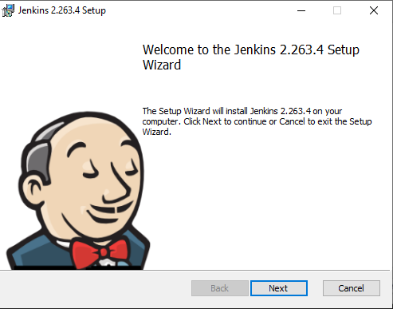
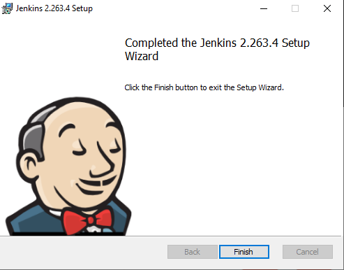
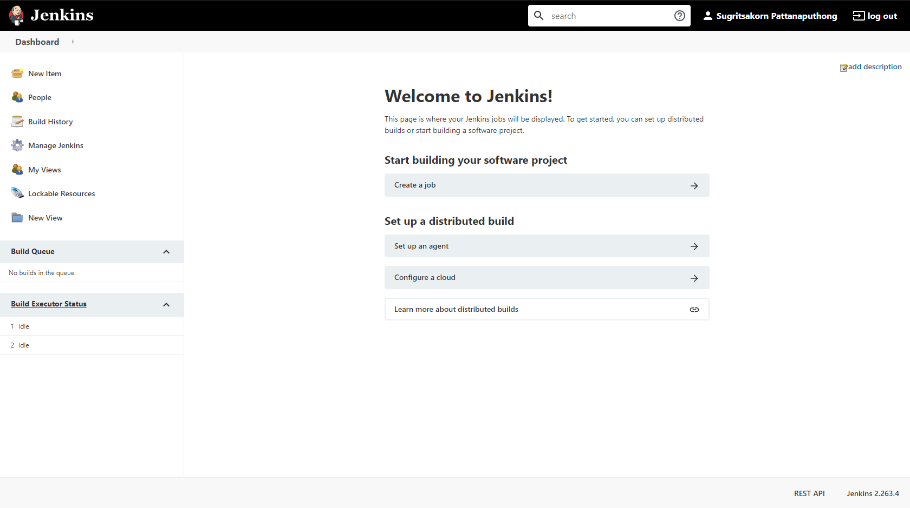
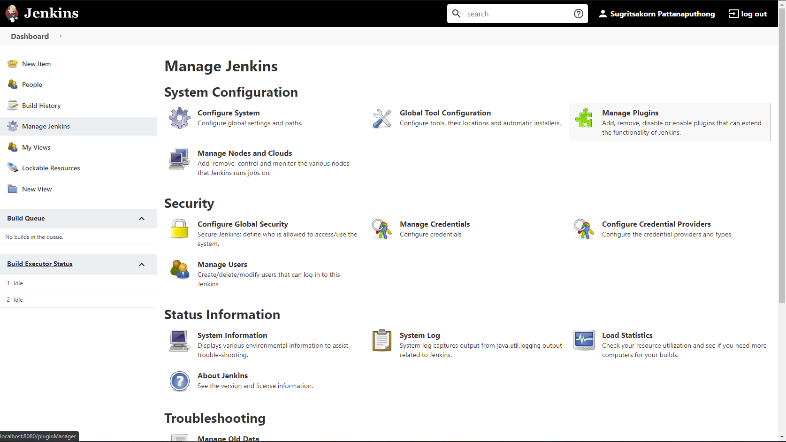
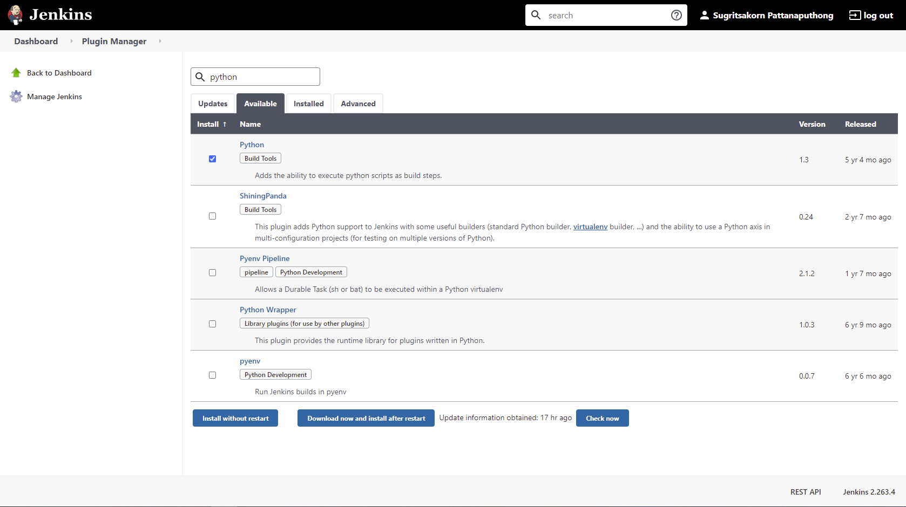

# การติดตั้ง Jenkins

ดาวน์โหลด Jenkins Installer มาจากเว็บไซต์  [Jenkins Download](https://www.jenkins.io/download/)

หลังจากได้ Installer มาแล้ว ให้ติดตั้งตามขั้นตอนจนเสร็จสิ้น

เมื่อติดตั้งเสร็จสิ้น Jenkins จะพาเราไปยัง localhost:port ที่เราได้ตั้งไว้

เราจะพบว่า Jenkins ของเรานั้น โดน Lock อยู่ เราต้องทำการ Unlock โดยเข้าไปที่ไฟล์ initialAdminPassword ใน Directory ที่เห็น แล้วเอา Password ในไฟล์นั้น ใส่ลงไปในช่อง Administrator Password เพื่อทำการ Unlock Jenkins

หลังจากที่เรา Unlock Jenkins แล้ว เราจะไปยังหน้า Customize Jenkins

ให้เราเลือก Install Suggested Plugins จะทำให้เราได้ Plugin เกี่ยวกับเครื่องมือที่ใช้กันบ่อย ๆ เช่น Github

จะทำให้เราสามารถ Pull code จาก Github ได้

เมื่อติดตั้ง Plugins เสร็จแล้ว Jenkins จะพาเราไปยังหน้า Create First Admin User

	

ให้เราทำการ Create User ให้เรียบร้อย แล้ว Jenkins จะพาเราไปหน้า  Home

	

แล้วให้เราไปที่ Manage Jenkins > Manage Plugin เพื่อติดตั้ง plugin ของ robot framework และ compiler สำหรับภาษาต่าง ๆ

ในการติดตั้ง plugin หลังจากที่เข้ามาจากเมนู Manage Plugin ให้ไปที่แทบ Available

สำหรับ plugin ของ robot framework ให้ search คำว่า robot framework

สำหรับ plugin ของ compiler ให้ search ชื่อภาษาที่เราต้องการ

เมื่อเจอสิ่งที่ต้องการ ให้เลือก plugin ที่ต้องการติดตั้ง แล้วกด download now and install after restart

จะทำให้เราสามารถใช้ Jenkins ทำงานกับ Robot Framework และสามารถ Compile code ที่เขียนด้วยภาษาต่าง ๆ ได้